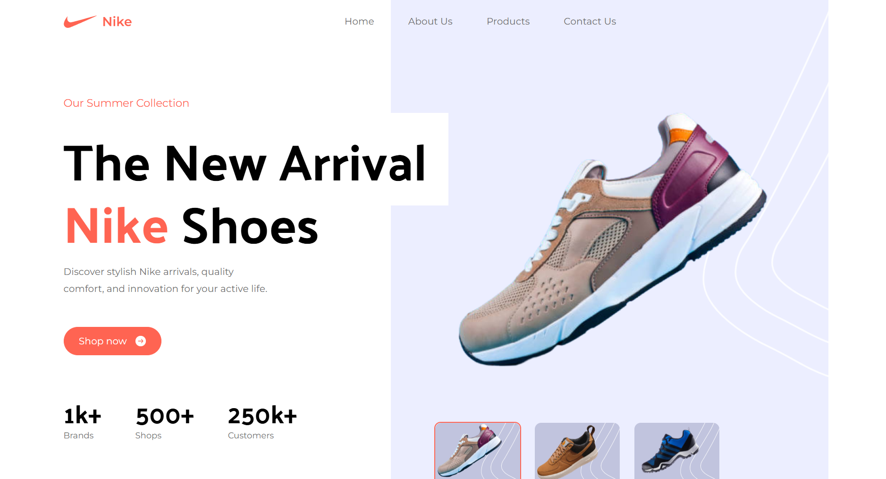
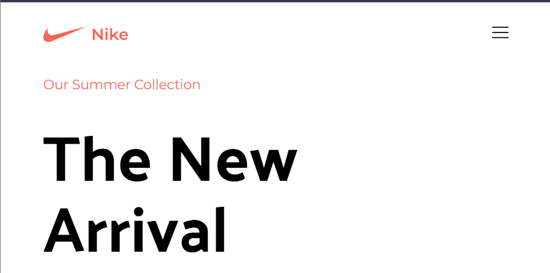

# 🚀 JavaScript Mastery CSS Project

Welcome to your **CSS Project** built with [Vite](https://vitejs.dev/) + [React](https://react.dev/) + [Tailwind CSS](https://tailwindcss.com/)!  
Unleash your creativity and master modern front-end development! 🎨✨

---

## 📸 Screenshot


<!-- Replace with your actual screenshot file path -->

---

## 🛠️ Features

- ⚡ **Vite** for blazing-fast development
- ⚛️ **React** for building UI components
- 🌈 **Tailwind CSS** for utility-first styling
- 💡 Modern JavaScript best practices

---

## 🚀 Getting Started

1. **Clone the repo**
   ```bash
   git clone https://github.com/yamneg96/NikeWebsite.git
   cd NikeWebsite
   ```

2. **Install dependencies**
   ```bash
   npm install
   ```

3. **Start the development server**
   ```bash
   npm run dev
   ```

4. **Open in browser**
   ```
   http://localhost:5173
   ```

---

## 📂 Project Structure

```
src/
  components/    # Reusable React components
  App.jsx        # Main app component
  index.css      # Tailwind CSS imports
  ...
```

---

## 📝 Customization


- Update project details as needed.

---

## 🙌 Contributing

Contributions are welcome!  
Feel free to open issues or submit pull requests. 🚀

---

Made with ❤️ by Yamlak Negash
